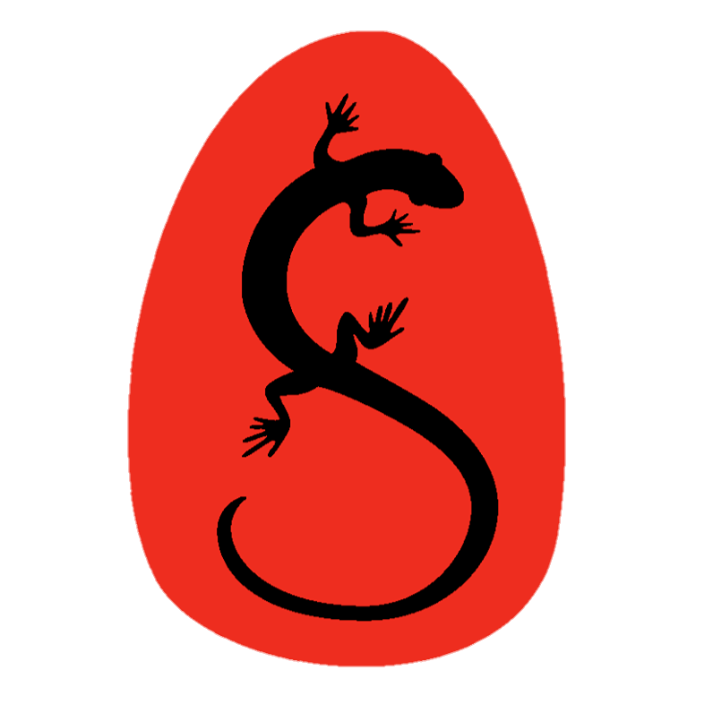

<div align="center">

# Senescalade



## Une application web en Nuxt pour les inscriptions de l'association Senescalade

      
    
    
[](https://app.deepsource.com/gh/EDM115-org/Senescalade/)

</div>

## Présentation

**Senescalade** est une application web permettant aux membres de l'association Senescalade de s'inscrire en début d'année. Les nouveaux membres peuvent créer un compte et inscrire les grimpeurs, tandis que les membres déjà inscrits peuvent se connecter et se réinscrire facilement.  
L'application est développée en Nuxt.js, un framework basé sur Vue.js, utilise Vuetify pour le style et Pinia pour le store, et utilise une base de données MySQL pour stocker les informations des membres et des événements. Chaque mot de passe est chiffré avec bcrypt, et les emails sont envoyés via Nodemailer.  
L'application est également disponible en tant qu'image Docker sur Docker Hub : [https://hub.docker.com/r/edm115/senescalade](https://hub.docker.com/r/edm115/senescalade).  
Une interface d'administration est également disponible pour les administrateurs de l'association, permettant de visualiser les inscriptions, les membres, les séances, planifier les réinscriptions, ...

## Fonctionnalités

### Côté utilisateur

- Inscription
- Connexion
- Ajout de grimpeurs
- Inscription aux séances
- Réinscription semi-automatique
- Mise en file d'attente pour les séances pleines
- Réininialisation du mot de passe
- Vérification du compte
- Changement de thème (clair/sombre)
- Possibilité de rester connecté 30 jours au lieu de 24h

### Côté administrateur

- Dashboard pour visualiser en un coup d'oeil l'état global de la base de données
- Visualisation/suppression des membres
- Visualisation/modification/suppression des séances + export en PDF d'une liste d'appel
- Visualisation/modification/suppression des inscriptions
- Ajout/suppression d'admins avec gestion des droits
- Gestion des réinscriptions
- Modification du mot de passe

## Déploiement

**Prérequis :**  
- Node.js 20 (LTS), à installer avec `nvm install lts/iron && nvm use lts/iron` si besoin
- Docker
- Docker Compose

```bash
git clone https://github.com/EDM115-org/Senescalade.git && cd Senescalade
npm run i
```

Créez 2 fichiers contenant les variables d'environnement à la racine du projet :

- `.env` pour le développement

```env
DB_HOST=localhost
DB_USER=sae
DB_PASSWORD="UserPassword"
DB_NAME=sae
DB_PORT=3306
DEV_PORT=8000
GMAIL_USER="adresse-email@gmail.com"
GMAIL_PASS="abcd efgh ijkl mnop"
MYSQL_ROOT_PASSWORD="SomethingStrong"
PORT=56860
```

- `.prod.env` pour la production

```env
DB_HOST=db
DB_USER=sae
DB_PASSWORD="UserPassword"
DB_NAME=sae
DB_PORT=3306
DEV_PORT=56860
GMAIL_USER="adresse-email@gmail.com"
GMAIL_PASS="abcd efgh ijkl mnop"
MYSQL_ROOT_PASSWORD="SomethingStrong"
PORT=56860
```

`GMAIL_PASS` : Mot de passe d'application spécifique, voir https://nodemailer.com/usage/using-gmail/ et https://support.google.com/accounts/answer/185833

```bash
npm run docker-start
```

Accessible à http://localhost/ (port `80` en prod, modifiable dans le `docker-compose.yml`)

> [!CAUTION]
> MySQL est lent à démarrer. Normalement la webapp est sensée attendre que le service MySQL démarre, mais si ce n'est pas le cas, utilisez les commandes suivantes :

```bash
docker compose logs  # vérifiez la mention "[Note] [Entrypoint]: MySQL init process done. Ready for start up."
npm run docker-restart
```

Pour arrêter :

```bash
npm run docker-stop
```

## Développement

**Prérequis :**
- Les prérequis de déploiement plus :
- MySQL 8.0 (~8.0.37)

### Première installation

- **Windows**

```sql
\sql
\connect root@localhost
\source "C:\Path\To\Senescalade\db\create_user.sql"
\source "C:\Path\To\Senescalade\db\create_db.sql"
\source "C:\Path\To\Senescalade\db\instantiate_db.sql"
\source "C:\Path\To\Senescalade\db\insert_test.sql"
```

- **Linux**

```bash
mysql -u root -p < /path/to/Senescalade/db/create_user.sql
mysql -u root -p < /path/to/Senescalade/db/create_db.sql
mysql -u root -p < /path/to/Senescalade/db/instantiate_db.sql
mysql -u root -p < /path/to/Senescalade/db/insert_test.sql
```

Puis dans un terminal

```bash
npm run i
npm run dev
```

Accessible à http://localhost:8000/

### Structure du code

```plaintext
.
├── .github/ : Fichiers de configuration GitHub
├── .vscode/ : Extensions recommandées et paramètres pour VSCode
├── assets/ : Contient le style css et un outil pour la traduction de messages d'erreur
├── components/ : Composants de l'application Nuxt (formulaires, barres de navigation, modals, ...)
├── db/ : Fichiers SQL pour la création de la base de données
├── layouts/ : Layouts de l'application Nuxt (défaut et admin)
├── locales/ : Traductions des messages d'erreur
├── Organisation/ : Les rendus de la SAE
├── pages/ : Pages de l'application Nuxt
│   ├── admin/
│   │   ├── dashboard/ : Dashboard de l'admin
│   │   ├── gestion-admin/ : Page de gestion des admins
│   │   ├── gestion-grimpeurs/ : Page de gestion des grimpeurs
│   │   ├── gestion-seances/ : Page de gestion des séances
│   │   ├── gestion-utilisateur/ : Page de gestion des utilisateurs
│   │   ├── profil/:  Modification du mot de passe
│   │   └── reinscription/ : Page de gestion des réinscriptions
│   ├── login/ : Pages de connexion, de vérification de mail et d'oubli de mot de passe
│   ├── register/ : Pages d'inscription et de réinscription
│   ├── seances/ : Pages de visualisation des séances
│   ├── user/ : Pages pour les utilisateurs connectés (profil, ajout de grimpeurs, réinscription, finir l'inscription après une file d'attente, voir ses grimpeurs, ...)
│   └── index.vue : Page d'accueil
├── plugins/ : Plugins de l'application Nuxt (Vuetify, Pinia)
├── public/ : Fichiers statiques (images, robots.txt)
├── server/ : Serveur Nitro avec H3
│   ├── api/ : API REST pour les requêtes à la base de données
│   │   ├── add.js : Requêtes INSERT
│   │   ├── count.js : Requêtes COUNT
│   │   ├── db.js : Gestion des pools de connexions MySQL
│   │   ├── delete.js : Requêtes DELETE
│   │   ├── fetch.js : Requêtes SELECT
│   │   ├── forgotPassword.js : Requêtes pour l'oubli de mot de passe
│   │   ├── login.js : Requêtes pour la connexion
│   │   ├── mailVerify.js : Requêtes pour la vérification de mail
│   │   ├── notifySeance.js : Requêtes pour notifier les utilisateurs qu'une place s'est libérée dans une séance
│   │   ├── register.js : Requêtes pour l'inscription
│   │   ├── reinscription.js : Requêtes pour la réinscription
│   │   └─── update.js : Requêtes UPDATE
│   └── middleware/ : Middleware pour la vérification des tokens
├── store/ : Store de l'application Nuxt (Pinia)
├── docker-compose.yml : Fichier de configuration Docker Compose
├── Dockerfile : Fichier de configuration Docker
├── error.vue : Page d'erreur (renvoie à la page d'accueil)
├── nuxt.config.js : Configuration de l'application Nuxt
├── package.json : Fichier de configuration NPM
├── start.sh : Script de démarrage de l'application pour Docker
└── wait-for-it.sh : Script pour attendre que MySQL démarre, [source](https://github.com/vishnubob/wait-for-it)
```

### Build du Dockerfile

- **Build**

```bash
docker build -t edm115/senescalade .
docker run -d --env-file ./.env -p 80:56860 --name senescalade edm115/senescalade
```

- **Run**

```bash
docker start senescalade
```

- **Publish**

```bash
docker tag edm115/senescalade edm115/senescalade:latest
docker push edm115/senescalade:latest
```

## Licence

Ce projet est sous licence MIT. Voir le fichier `LICENSE` pour plus d'informations.
